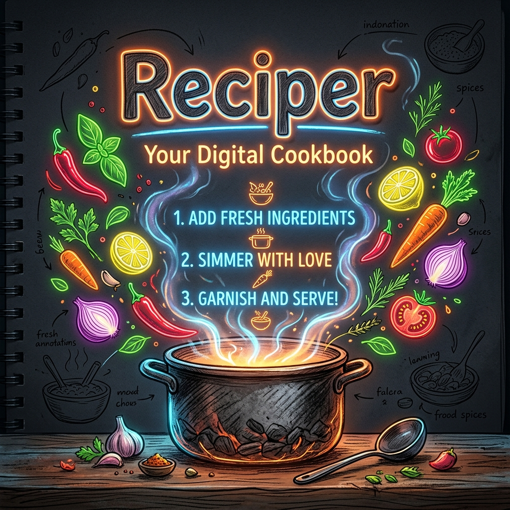

<div align="center">
  
  
  <br />

  # 🍳 Reciper
  ### *Where Sketchbook Aesthetics Meet AI Gastronomy*

  <p align="center">
    
    
    
    
  </p>

  
</div>

## ✨ Features

- **⚡ Gemma 4 Primary Engine**: Powered by the state-of-the-art **Gemma 4 (31B Dense)** model, ensuring deep culinary reasoning and authentic recipes.
- **🛡️ Adaptive Stability**: Intelligent automatic fallback to **Gemini 3 Flash** if the primary engine encounters issues.
- **🎨 Hand-Drawn Aesthetic**: A unique sketchbook UI that feels personal, organic, and visually stunning.
- **🐍 Python-Powered Backend**: A robust FastAPI server handles all AI logic, securing your API keys and enabling high-performance processing.
- **🌍 Global Gastronomy**: Real-time trending dishes gathered from social buzz and food blogs across the globe.

---

## 🚀 Quick Start

### 1. Requirements
- **Node.js** (v18+)
- **Python** (v3.10+)
- **Gemini API Key**

### 2. Setup
Clone the repository and install dependencies for both environments:

```bash
# Install Node dependencies
npm install

# Install Python dependencies
npm run install-py
```

### 3. Configuration
Create a `.env` file in the root directory:
```env
GEMINI_API_KEY="your_api_key_here"
```

### 4. Launch
Start the project by running two commands in separate terminals:

```bash
# Terminal 1: Python Backend
npm run python-dev

# Terminal 2: Vite Frontend
npm run dev
```

---

## 📡 API Architecture

Reciper uses a modern hybrid architecture designed for **Vercel** serverless deployments:

- **`/api/*`**: Python FastAPI endpoints hosted as Vercel Serverless Functions.
- **Frontend**: Vite + React optimized for instant HMR and sleek animations.

---

<div align="center">
  
  <br />
  <p><i>Generated with passion for food and code.</i></p>
</div>
